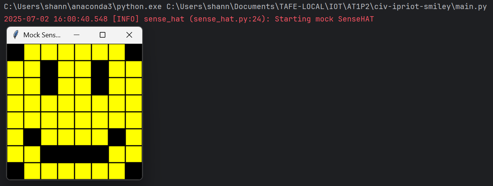

# Evidence and Knowledge

This document includes instructions and knowledge questions that must be completed to receive a *Competent* grade on this portfolio task.

## 1. Required evidence

### 1.1. Answer all questions in this document

- Each answer should be complete, well-articulated, and within the specified word count limits (if added) for each question.
- Please make sure **all** external sources are properly cited.
- You must **use your own words**. Please include your full chat transcripts if you use generative AI in any way.
- Generative AI hallucinates, is not an authoritative source

### 1.2. Make all the required modifications to the code

- Please follow the instructions in this document to make the changes needed to the code.

- When requested to upload evidence, upload all screenshots to `screenshots/` and embed them in this document. For example:

```markdown

```


> Note the `!`, and the use of a relative path.

- You must upload the code into your GitHub repository.
- While you can use a branch, your code should be in main when you submit.
- Upload a zip of this repository to Blackboard when you are ready to submit.
- You will be notified of your result via Blackboard
- However, if using GitHub classrooms, you may also receive additional feedback on GitHub directly

### 1.3. Optional: Use of Raspberry Pi and SenseHat

Raspberry Pi or SenseHat is **optional** for this activity. You can use the included `sense_hat.py` file to simulate the SenseHat on your computer.

If you use a Pi, please **delete** the `sense_hat.py` file.

### 1.4. Accessible version of the code

This project relies on visual patterns that appear on an LED matrix. If you have any accessibility requirements, you can use the `udl/accessible` branch to complete the project. This branch provides an accessible code version that uses text-based patterns instead of visual ones.

Please discuss this with your lecturer before using that branch.

## 2. Specific Tasks & Questions

Address the following tasks and questions based on the code provided in this repository.

### 2.1. Set up the project locally

1. Fork this repository (if not using GitHub Classrooms)
2. Clone your repository locally
3. Run the project locally by executing the `main.py` file
4. Evidence this by providing screenshots of the project directory structure and the output of the `main.py` file



If you are running on a Raspberry Pi, you can use the following command to run the project and then screenshot the result:

```bash
ls
python3 main.py
```

### 2.2. Fundamental code comprehension

 Answer each of the following questions **as they relate to that code** supplied by in this repository (ignore `sense_hat.py`):

1. Examine the code for the `smiley.py` file and provide  an example of a variable of each of the following types and their corresponding values (`_` should be replaced with the appropriate values):

   | Type                    | name     | value        |
   | ----------              |----------| ------------ |
   | built-in primitive type | dimmed   |  True        |
   | built-in composite type | WHITE    |(255, 255, 255) |
   | user-defined type       |self.sense_hat |  SenseHat()|

2. Fill in (`_`) the following table based on the code in `smiley.py`:

   | Object                   | Type  |
   | ------------             |-------|
   | self.pixels              | list  |
   | A member of self.pixels  | tuple |
   | self                     | Smiley |

3. Examine the code for `smiley.py`, `sad.py`, and `happy.py`. Give an example of each of the following control structures using an example from **each** of these files. Include the first line and the line range:

   | Control Flow | File   | First line | Line range |
   | ------------ |--------|------------|------------|
   |  sequence    | sad.py | 1          | 1 to 30    |
   |  selection   | sad.py | 26         | 26 to 29   |
   |  iteration   | sad.py | 16         | 16 to 17   |

4. Though everything in Python is an object, it is sometimes said to have four "primitive" types. Examining the three files `smiley.py`, `sad.py`, and `happy.py`, identify which of the following types are used in any of these files, and give an example of each (use an example from the code, if applicable, otherwise provide an example of your own):

   | Type                    | Used?    | Example                                                   |
   | ----------------------- |----------|-----------------------------------------------------------|
   | int                     | happy.py | each individual value in mouth = [41, 46, 50, 51, 52, 53] |
   | float                   | happy.py | delay=0.25                                                |
   | str                     | no       | example_string = "example"                                |
   | bool                    | happy.py | wide_open=True                                            |

5. Examining `smiley.py`, provide an example of a class variable and an instance variable (attribute). Explain **why** one is defined as a class variable and the other as an instance variable.

> In smiley.py we have a class named `Smiley` that contains class wide variables of WHITE, GREEN, RED, YELLOW, BLANK.`def __init__(self): self.sense_hat = SenseHat()`, is an example of an instance variable. When we instantiate an object from a class we want each object created to have their own attributes specific to that class, but we still would like all instances to share the same variable we use a class variable. For our smiley example we want all smilies to use the same colours, but each smiley have a their own unique colour properties that only effect the instantiated object.
>

6. Examine `happy.py`, and identify the constructor (initializer) for the `Happy` class:
   1. What is the purpose of a constructor (in general) and this one (in particular)?

  
   > 
   >A constructor is a special method used to initialize an object. A class is like a blueprint and an object is created based upon this blueprint.
   > for each object to have its own unique data, an initializer is used with `init` and `self` to reference each object created. 
   > 
> In our happy class, we use an initializer `def __init__(self):` to prepare our smiley face. Calling `super().__init__()` we gain the init properties
> of our smiley class which contain the sensehat object and the unset arrangement of pixels for our face. `self.draw_mouth()
        self.draw_eyes()` are then used in the happy init to colour select pixels to make what looks like a happy face. 

   2. What statement(s) does it execute (consider the `super` call), and what is the result?

   > For our `draw_mouth` and `draw_eyes` methods we are adjusting the colours of pixels which are inherited from the super class.
> we are calling the methods inside the init causing the methods to execute for each object instance created. The output of these methods change 
   > the colours in the positions in a 8x8 grid making the result object look like a smiley face.
   >

### 2.3. Code style

1. What code style is used in the code? Is it likely to be the same as the code style used in the SenseHat? Give to reasons as to why/why not:

> The style used in this code adheres to PEP-8 standards. It is the same style used in the sense hat as in `sense_hat.py`.
> 
>

2. List three aspects of this convention you see applied in the code.

> Consistent use of 4 space indentation
> Naming conventions of variables and classes
> Each import seperated on different lines
> 
>

3. Give two examples of organizational documentation in the code.

>   """
   Provides a Smiley with a happy expression
    """
> 
> """
Draws open or closed eyes on a smiley
:param wide_open: Render eyes wide open or shut
"""
>

### 2.4. Identifying and understanding classes

> Note: Ignore the `sense_hat.py` file when answering the questions below

1. List all the classes you identified in the project. Indicate which classes are base classes and which are subclasses. For subclasses, identify all direct base classes.
  
  Use the following table for your answers:

| Class Name | Super or Sub? | Direct parent(s)                                   |
|------------|---------------|----------------------------------------------------|
| Smiley     | super         | foundation/base/parent<br/>parent of Happy and Sad |
| Happy      | sub           | No children/child of Smiley                        |
| Sad        | sub           | No children/child of Smiley                                              |

2. Explain the concept of abstraction, giving an example from the project (note "implementing an ABC" is **not** in itself an example of abstraction). (Max 150 words)

> Abstraction is the compression and expression of ideas. Abstraction in OOP is being able to hide complex details to simplify
> interface and expose only what is necessary.
> In our project an example of extraction is used in our `Happy` class method `draw_mouth()`. This is an example of abstraction
> as we are hiding the details of what the method does so that we are able to simply refer to `draw_mounth()` with simple reference.
> 
>

3. What is the name of the process of deriving from base classes? What is its purpose in this project? (Max 150 words)

> Inheritance. The use of inheritance in this project is found in our `Happy` and `Sad` classes. We are inheriting from 
> the base class `Smiley` the traits and behaviours into our `Happy` and `Sad` class to reuse and extend functionality.
> The purpose of having a separate class over having a happy and sad method in our smiley, helps for clear separation
> of behaviour, cleaner design, improved abstraction.
>

### 2.5. Compare and contrast classes

Compare and contrast the classes Happy and Sad.

1. What is the key difference between the two classes?
   > `Sad` does not inherit the `Blinkable` class and have different pixel positions for mouth for happy and sad faces
   >
2. What are the key similarities?
   > Both classes inherit from `Smiley` gaining traits and behaviours by use of inheritance and init methods. Both 
   > classes have the same methods draw_eyes
   >
3. What difference stands out the most to you and why?
   > The pixel positions to draw the mouth have different values for class `Happy` and `Sad`. The different values in 
   > their draw_mouth() functions relate to where on the 8x8 grid of pixels - given by the class `Smiley` - the mouth 
   > will be drawn. This stands out the most as since the eye values dont change, its just the mouth that does.
   >
4. How does this difference affect the functionality of these classes
   > The output of what colour pixels will be yellow or black in certain positions will change the output of the mouth
   > to look happy or sad/smiling or frowning.
   >

### 2.6. Where is the Sense(Hat) in the code?

1. Which class(es) utilize the functionality of the SenseHat?
   > All classes utilize the SenseHat that is based in the `Smiley` class.
   >
2. Which of these classes directly interact with the SenseHat functionalities?
   > The `Smiley` class is the origin of where the SenseHat is based, but as `Happy` and `Sad` both inherit smiley and
   > refer to the super class, all classes can directly interact with the SenseHat as they all inherit the behaviours
   >
3. Discuss the hiding of the SenseHAT in terms of encapsulation (100-200 Words)
   > We are encapsulating the SenseHAT to hide the details of the SenseHAT configuration code. We are wanting to protect
   > the SenseHAT object details along with hiding its complexity through abstraction storing in an instance attribute 
   > `self.sense_hat`. The aim is to protect the internal SenseHAT object from direct user access.
   >

### 2.7. Sad Smileys Can’t Blink (Or Can They?)

Unlike the `Happy` smiley, the current implementation of the `Sad` smiley does not possess the ability to blink. Let's first explore how blinking has been implemented in the Happy Smiley by examining the blink() method, which takes one argument that determines the duration of the blink.

**Understanding Blink Mechanism:**

1. Does the code's author believe that every `Smiley` should be able to blink? Explain.

> I assume the author may also like the functionality of blink to also be implementable in `Sad`. The decision of only
> happy faces can blink does not seem like it cant also be used by sad.
>

2. For those smileys that blink, does the author expect them to blink in the same way? Explain.

> Every `Happy` smiley object that is created is expected to blink in the same way as the blink implementation is fixed
> to blink once at a rate of 0.25.
>

3. Referring to the implementation of blink in the Happy and Sad Smiley classes, give a brief explanation of what polymorphism is.

> Polymorphism is the use of an inherited behaviour or method and changed for use in a separate class. Polymorphism
> is used in the `Happy` class by inheriting the blink method from blinkable.py and overriding the method for its own
> version in happy.
>

4. How is inheritance used in the blink method, and why is it important for polymorphism?

> We inherit the blink method so that the same variable is available in the `Happy` class. This is important for polymorphism
> as instead of reimplementing a similar same variable, we can override the behaviour and reuse code
>
1. **Implement Blink in Sad Class:**

   - Create a new method called `blink` within the Sad class. Ensure you use the same method signature as in the Happy class:

   ```python
   def blink(self, delay=0.25):
       pass  # Replace 'pass' with your implementation
   ```

2. **Code Implementation:** Implement the code that allows the Sad smiley to blink. Use the implementation from the Happy Smiley as a reference. Ensure your new method functions similarly by controlling the blink duration through the `delay` argument.

3. **Testing the Implementation:**

- Test the new blink functionality on your Raspberry Pi or within the Python classes provided. You might need to adjust the `main.py` script to incorporate Sad Smiley's new blinking capability.

Include a screenshot of the sad smiley or the modified `main.py`:


- Observe and document the Sad smiley as it blinks its eyes. Describe any adjustments or issues encountered during implementation.

  > I adjusted the delay of the blink from 0.25 to 0.5 for the sad smiley. I imported time in sad.py. i did not use inheritance
  > and have given `Sad` its own blink method.

  ### 2.8. If It Walks Like a Duck…

  Previously, you implemented the blink functionality for the Sad smiley without utilizing the class `Blinkable`. Assuming you did not use `Blinkable` (even if you actually did), consider how the Sad smiley could blink similarly to the Happy smiley without this specific class.

  1. **Class Type Analysis:** What kind of class is `Blinkable`? Inspect its superclass for clues about its classification.

     > Blinkable is an abstract class

  2. **Class Implementation:** `Blinkable` is a class intended to be implemented by other classes. What generic term describes this kind of class, which is designed for implementation by others? **Clue**: Notice the lack of any concrete implementation and the naming convention.

  > interface. Defines what a class must do

  3. **OO Principle Identification:** Regarding your answer to question (2), which Object-Oriented (OO) principle does this represent? Choose from the following and justify your answer in 1-2 sentences: Abstraction, Polymorphism, Inheritance, Encapsulation.

  > Blinkable is using the concept of abstraction as the abstract method is defining what it should do, not how it does it
  > hiding its details. blink() is defining what the abstract method should do, hiding its abstraction without doing it.

  4. **Implementation Flexibility:** Explain why you could grant the Sad Smiley a blinking feature similar to the Happy Smiley's implementation, even without directly using `Blinkable`.

  > Currently Sad isnt inheriting Blinkable so it does not need to pass blink abstract method checks and can implement a
  > blinking feature with any variable name. 

  5. **Concept and Language Specificity:** In relation to your response to question (4), what is this capability known as, and why is it feasible in Python and many other dynamically typed languages but not in most statically typed programming languages like C#? **Clue** This concept is hinted at in the title of this section.

  > Duck typing. Python is a dynamically typed language and allows for objects to based as something by its behaviours rather 
  > than its declared type. You dont need to declare or inherit from a specific class to be considered 'duck enough'. If an object 
  > has the methods or behaviours it will be treated as same. 

  ***

  ## 3. Refactoring

  ### 3.1. Does a Smiley Have to Be Yellow?

  While our current implementation predominantly features yellow smileys, emotional expressions like sickness or anger typically utilize colors like green, red, or orange. We'll explore the feasibility of integrating these colors into our smileys.

  1. **Defined Colors and Their Location:**

     1. Which colors are defined and in which class(s)?
        > White, green, red, yellow, blank is also used for no colour. This is defined in our smiley.py class attributes`Smiley`
     2. What type of variables hold these colors? Are the values expected to change during the program's execution? Explain your answer.
        > the variables are stored in class attribute variables of WHITE, GREEN, RED, YELLOW individually. Each variable is storing 
         a tuple of 3 int values that correspond to red, green, blue (RGB). 
     3. Add the color blue to the appropriate class using the appropriate format and values.
        > 
  2. **Usage of Color Variables:**

     1. In which classes are the color variables used?
        > Your answer here

  3. **Simple Method to Change Colors:**
  4. What is the easiest way you can think to change the smileys to green? Easiest, not necessarily the best!
     > Your answer here

  Here's a revised version of the "Flexible Colors – Step 1" section for the smiley project, incorporating your specifications for formatting and content updates:

  ### 3.2. Flexible Colors – Step 1

  Changing the color of the smileys once is straightforward, but it isn't very flexible. To facilitate various colors for smileys, it is advisable not to hardcode values in any class. This approach was identified earlier as a necessary change. Let's start by removing the built-in assumptions about color in our classes.

  1. **Add a method called `complexion` to the `Smiley` class:** Implement this instance method to return `self.YELLOW`. Using the term "complexion" instead of "color" provides a more abstract terminology that focuses on the meaning rather than implementation.

  2. **Refactor subclasses to use the `complexion` method:** Modify any subclass that directly accesses the color variable to instead utilize the new `complexion` method. This ensures that color handling is centralized and can be easily modified in the future.

  3. **Determine the applicable Object-Oriented principle:** Consider whether Abstraction, Polymorphism, Inheritance, or Encapsulation best applies to the modifications made in this step.

  4. **Verify the implementation:** Ensure that the modifications function as expected. The smileys should still display in yellow, confirming that the new method correctly replaces the direct color references.

  This step is crucial for setting up a more flexible system for color management in the smiley display logic, allowing for easy adjustments and extensions in the future.

  ### 3.3. Flexible Colors – Step 2

  Having removed the hardcoded color values, we now enhance the base class to support dynamic color assignments more effectively.

  1. **Modify the `__init__()` method in the `Smiley` class:** Introduce a default argument named `complexion` and assign `YELLOW` as its default value. This allows the instantiation of smileys with customizable colors.

  2. **Introduce a new instance variable:** Create a variable called `my_complexion` and assign the `complexion` parameter to it. This step ensures that each smiley instance can maintain its own color state.

  3. **Rationale for `my_complexion`:** Using a distinct instance variable like `my_complexion` avoids potential conflicts with the method parameter names and clarifies that it is an attribute specific to the object.

  4. **Bulk rename:** We want to update our grid to use the value of complexion, but we have so many `Y`'s in the grid. Use your IDE's refactoring tool to rename all instances of the **symbol** `Y` to `X`. Where `X` is the value of the `complexion` variable. Include a screenshot evidencing you have found the correct refactor tool and the changes made.

  

  5. **Update the `complexion` method:** Adjust this method to return `self.my_complexion`, ensuring that whatever color is assigned during instantiation is what the smiley displays.

  6. **Verification:** Run the updated code to confirm that Smileys still defaults to yellow unless specified otherwise.

  ### 3.4. Flexible Colors – Step 3

  With the foundational changes in place, it's now possible to implement varied smiley colors for different emotional expressions.

  1. **Adjust the `Sad` class initialization:** In the `Sad` class's initializer method, change the superclass call to include the `complexion` argument with the value `self.BLUE`, as shown:

     ```python
     super().__init__(complexion=self.BLUE)
     ```

  2. **Test color functionality for the Sad smiley:** Execute the program to verify that the Sad smiley now appears blue.

  3. **Ensure the Happy smiley remains yellow:** Confirm that changes to the Sad smiley do not affect the default color of the Happy smiley, which should still display in yellow.

  4. **Design and Implement An Angry Smiley:** Create an Angry smiley class that inherits from the `Smiley` class. Set the color of the Angry smiley to red by passing `self.RED` as the `complexion` argument in the superclass call.

  ***
